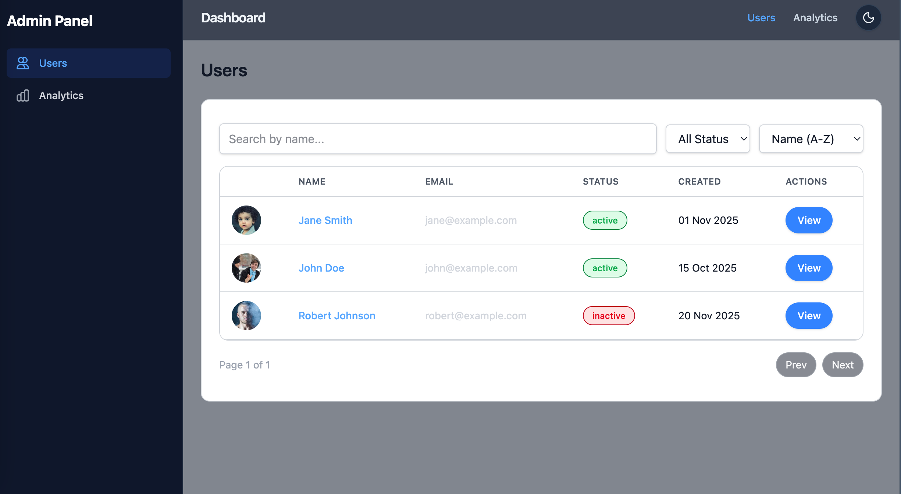

# User Dashboard

A modern, responsive admin dashboard built with React, TypeScript, and Tailwind CSS. This dashboard provides user management, analytics visualization, and a clean, intuitive interface.



## Features

- 📊 Interactive analytics with charts
- 👥 User management (view, add, edit, delete)
- 🌓 Light/Dark mode support
- 📱 Fully responsive design
- ⚡ Fast and optimized performance
- 🔒 Type-safe with TypeScript

## Tech Stack

- ⚛️ **React 19** - Frontend library
- 🔷 **TypeScript** - Type safety
- 🎨 **Tailwind CSS** - Utility-first CSS framework
- 🛣️ **React Router** - Client-side routing
- 📊 **Recharts** - Data visualization
- 🏪 **Zod** - Schema validation
- 🗄️ **Zustand** - State management (chosen for its simplicity, performance, and React integration)
- 🎨 **Lucide Icons** - Beautiful icons
- 📅 **date-fns** - Date utilities

## Getting Started

### Prerequisites

- Node.js 18+ and npm/yarn
- Git

### Installation

1. Clone the repository:
   ```bash
   git clone https://github.com/your-username/user-dashboard.git
   cd user-dashboard
   ```

2. Install dependencies:
   ```bash
   npm install
   # or
   yarn
   ```

3. Start the development server:
   ```bash
   npm run dev
   # or
   yarn dev
   ```

4. Open [http://localhost:5173](http://localhost:5173) in your browser.

### Building for Production

```bash
npm run build
# or
yarn build
```

## Project Structure

```
src/
├── components/     # Reusable UI components
├── pages/         # Page components
├── utils/         # Utility functions and mock data
└── App.tsx        # Main application component
```

## Architecture

- **Component-Based Architecture**: The application is built using reusable, self-contained components.
- **State Management**: Uses Zustand for simple and efficient state management.
- **Routing**: Implements client-side routing with React Router for seamless navigation.
- **Responsive Design**: Fully responsive layout that works on all device sizes.
- **Type Safety**: Comprehensive TypeScript integration for better developer experience.
- **Theming**: Supports light and dark modes using CSS variables.

## Available Scripts

- `npm run dev` - Start development server
- `npm run build` - Build for production
- `npm run preview` - Preview production build locally
- `npm run lint` - Run ESLint

